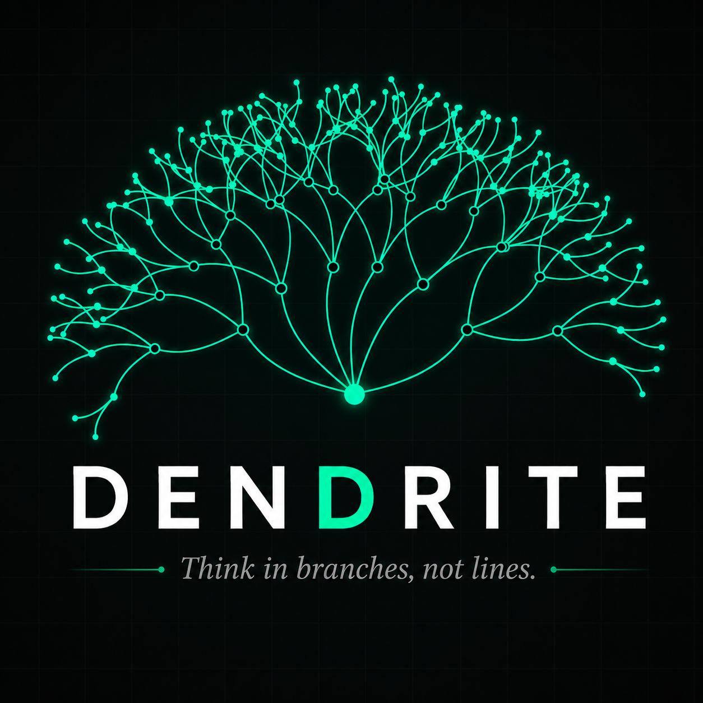
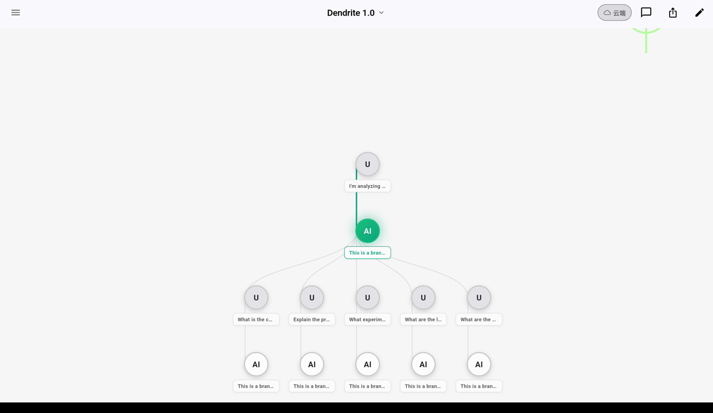
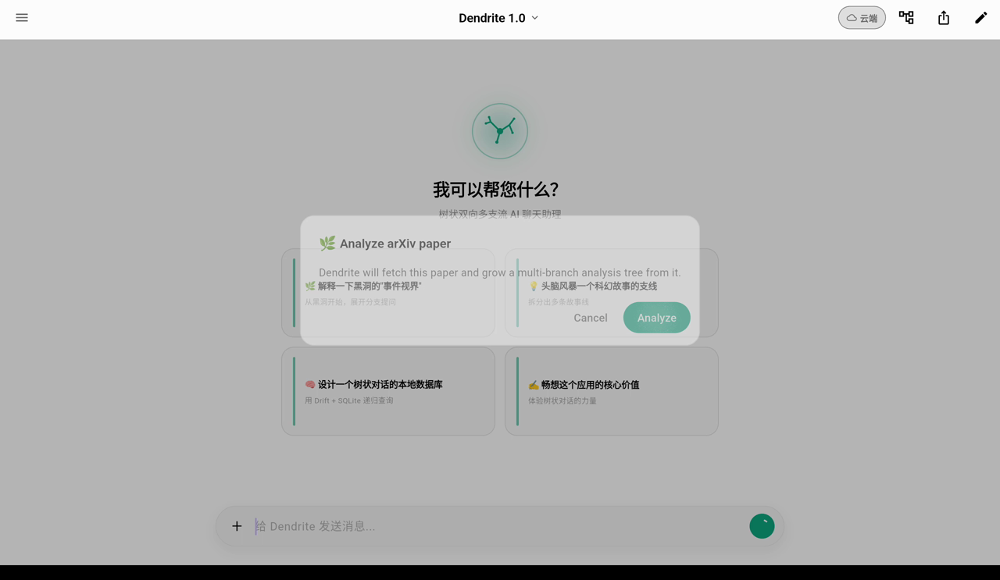
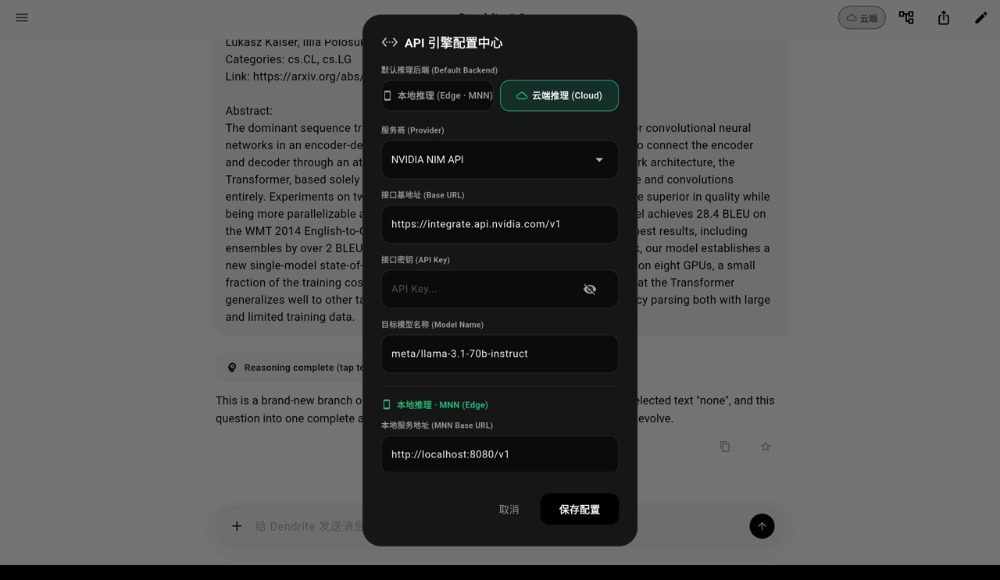

<div align="center">



# 🌿 Dendrite

### 用分支思考，别走直线。

**一个 AI 原生、非线性的移动端知识空间。**

[](LICENSE)
[](https://flutter.dev)
[]()

**简体中文** · [English](README.md)

</div>

---

## Dendrite 是什么？

传统的 AI 聊天是一条**直线**——每一条新回复都把上一条挤出视野，想顺着一个支线深挖，就只能放弃主线。Dendrite 把这条时间线彻底打开。

在 Dendrite 里，一段对话是一棵**树**。选中任意消息里的任意一句话，就能就地生出一条**分支**去探索它——而不丢失你原本的位置。每一条思路都被保留下来，整段对话化作一张实时的**思维导图**，随时可以漫游。它的名字取自神经元的*树突（dendrite）*：思想真正赖以蔓延的那些分叉结构。

> **一个问题。多个方向。无一遗漏。**

---

## 📸 实际效果

<div align="center">



<sub>整段对话即一张活的思维导图——每条分支都可导航，当前路径高亮显示。</sub>

</div>

<table>
<tr>
<td width="50%" valign="top">

<br/><sub><b>粘贴一个 arXiv / GitHub 链接</b> → Dendrite 自动抓取，并生长出一棵多分支分析树。</sub>
</td>
<td width="50%" valign="top">

<br/><sub><b>端侧 ↔ 云端</b>——通过 MNN 运行本地 Qwen 模型，或接入任意服务商。你的密钥，留在设备上。</sub>
</td>
</tr>
</table>

---

## ✨ 核心特性

| | 特性 | 说明 |
|---|---|---|
| 🌳 | **非线性分支** | 选中任意回复里的任意文字即可就地开分支。每条分支都把所选内容作为上下文带走，AI 因此清楚你到底在深挖哪一点。 |
| 🗺️ | **实时思维导图画布** | 整段对话渲染成一棵可交互的树。平移、缩放、点击节点即可跳转。当前所在的脉络高亮显示，收藏的节点带星标。 |
| 🌿 | **arXiv / GitHub 分析** | 粘贴一篇论文或一个仓库链接——Dendrite 自动抓取并生长出一棵多分支分析树（核心思想、方法、实验、局限……），每条分支都由你选定的模型作答。 |
| 📱 | **端侧 + 云端（混合）** | 通过 **MNN**（已适配 Arm SME2）运行本地 **Qwen** 模型，实现离线、私密、零成本推理——也可按对话、甚至**按分支**切换到云端。核心交互完全离线可用。 |
| 🧠 | **谱系感知上下文** | 模型每次只看到当前节点的祖先路径（一条递归 SQL CTE），而非整棵树——上下文更聚焦，token 成本更低。 |
| 🔀 | **多服务商 AI** | 一套引擎，三种协议方言：**OpenAI 兼容**（NVIDIA NIM、ModelScope、OpenAI、Grok、小米……）、**Anthropic** 与 **Google Gemini**。在设置里随时切换。 |
| ⚡ | **真·实时流式** | 基于 `dart:io` 的 `HttpClient` 实现逐 token 的 SSE，刻意绕开 Android `HttpURLConnection` 那套会拖垮 `package:http` 的缓冲机制。 |
| 💭 | **可见的推理** | 由系统提示词引导出逐步的 `<think>…</think>` 推理过程，并与最终答案区分渲染。 |
| 🔖 | **书签与搜索** | 给关键节点加星标，并在所有对话中检索任意一条消息。 |
| 📎 | **附件与 Markdown** | 把文件选入对话；回复以富文本 Markdown 渲染。 |
| 🔒 | **本地优先且安全** | 所有历史记录存于设备本地的 SQLite（Drift）。API 密钥存放在平台的安全存储（Keychain / Keystore）里——绝不明文落盘。 |
| 🎨 | **精致 UI** | ChatGPT 风格的编排式设计、悬浮胶囊输入框、定制的 Dendrite 矢量 Logo，支持明暗主题。 |

---

## 🏗️ 架构

```
lib/
├── main.dart                       # 应用入口、主题
├── core/
│   ├── agent/agent_engine.dart     # 多方言 SSE 流式引擎（OpenAI/Anthropic/Gemini）
│   ├── db/database.dart            # Drift schema、递归 CTE 谱系查询、搜索
│   ├── models/api_config.dart      # 服务商配置
│   └── utils/id_generator.dart
└── features/
    ├── chat/
    │   ├── chat_cubit.dart         # 状态（flutter_bloc）：分支、发送、搜索、书签
    │   ├── chat_repository.dart    # 持久化边界
    │   ├── chat_tree.dart          # 纯粹、可单测的树导航逻辑
    │   └── widgets/                # chat_screen、selection_menu
    ├── map/widgets/                # mind_map_canvas —— 可交互的树可视化
    └── settings/                   # settings_repository —— 密钥安全存储
```

- **状态管理：** 在仓储层之上用 `flutter_bloc`（`ChatCubit`）。
- **持久化：** `drift` + `sqlite3`，谱系由单条 `WITH RECURSIVE` CTE 解析。
- **树逻辑**被隔离在 `chat_tree.dart`（不依赖 UI / DB），因此分支逻辑可单元测试。

---

## 🚀 快速开始

### 前置条件
- [Flutter SDK](https://docs.flutter.dev/get-started/install) **3.x**（Dart `>=3.0.0`）
- 任一受支持服务商的 API 密钥（例如免费的 [NVIDIA NIM](https://build.nvidia.com/) 或 [ModelScope](https://modelscope.cn/) 密钥）

### 本地运行
```bash
# 1. 安装依赖
flutter pub get

# 2. 生成 Drift 数据库代码
dart run build_runner build --delete-conflicting-outputs

# 3. 启动（移动端或桌面端）
flutter run
```

随后在应用内打开**设置**，选择服务商、粘贴你的 API 密钥并挑选模型。密钥会安全地存储在设备本地。

> **可选 —— 在构建时内置密钥**（这样测试者无需自带密钥）：
> ```bash
> flutter run --dart-define=NVIDIA_API_KEY=your_key_here
> ```
> 支持的 define：`NVIDIA_API_KEY`、`MODELSCOPE_API_KEY`。

### 构建 Web（托管演示）
```bash
flutter build web --release --dart-define=NVIDIA_API_KEY=your_key_here
```
静态站点会输出到 `build/web/`——把该目录部署到任意静态托管（Netlify、GitHub Pages、Firebase Hosting、Vercel）即可。一键部署方案见 [`deploy/README.md`](deploy/README.md)。

---

## 🔌 数据来源

Dendrite **不在任何服务器上存储数据**——每段对话都存于设备本地的 SQLite 数据库。唯一的外部调用是你自行配置的 AI 推理请求：

| 服务商 | 方言 | 端点 |
|---|---|---|
| NVIDIA NIM | OpenAI 兼容 | `integrate.api.nvidia.com/v1` |
| ModelScope | OpenAI 兼容 | `api-inference.modelscope.cn/v1` |
| OpenAI / Grok / 小米 / … | OpenAI 兼容 | 由服务商定义 |
| Anthropic | Anthropic Messages | `…/messages` |
| Google Gemini | Gemini | `…/models/{model}:streamGenerateContent` |

你自带密钥；Dendrite 绝不经由任何第三方代理转发它。

---

## 🧪 测试
```bash
flutter test
```
树导航逻辑与数据库层均有单元测试覆盖。

---

## 📄 许可证

以 [MIT License](LICENSE) 发布。
